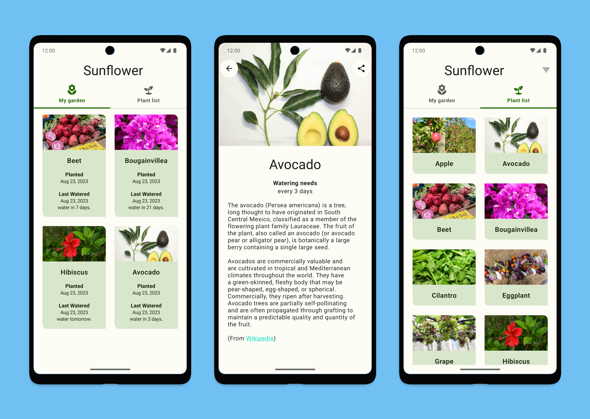

# Android Sunflower Java

本 fork 跟踪 [android/sunflower](https://github.com/android/sunflower)，并在上游 Kotlin/Compose
版本的 `app` 模块之外，继续保留历史 Java/View 实现 `app-java` 模块。

## 上游状态

注意：Sunflower 上游仓库已不再维护。Google 目前将
[compose-samples](https://github.com/android/compose-samples) 作为学习 Jetpack Compose 的最新示例来源。
如果你希望继续使用 Sunflower，请维护自己的 fork。

这是一个园艺 app，用来展示如何将基于 View 的 Android 应用迁移到 Jetpack Compose。
关于 Sunflower 迁移到 Compose 的过程，可以阅读
[迁移记录](https://github.com/android/sunflower/blob/main/docs/MigrationJourney.md)。

> [!NOTE]
> 原始 View 实现可参考上游 [`views`](https://github.com/android/sunflower/tree/views) 分支。
> 本 fork 额外保留了 Java/View 版本：`app-java`。

## 截图



## 功能

当前项目包含两个 app 模块：

- `app`：跟随上游的 Kotlin/Compose 实现。
- `app-java`：本 fork 维护的 Java/View 实现。

上游 `app` 展示了如何将一个 Material 2 的 View 应用迁移到 Material 3 的 Compose 应用。
`app-java` 保留了 Java + View/Data Binding/Navigation/Room/WorkManager 等传统 Jetpack 实现，方便仍在 Java
代码栈中的团队学习和对照。

## 环境要求

### JDK

项目使用 Android Gradle Plugin 8.x，需要 JDK 17。

如果使用 Homebrew，可安装：

```bash
brew install openjdk@17
```

构建时可设置：

```bash
export JAVA_HOME=/usr/local/opt/openjdk@17/libexec/openjdk.jdk/Contents/Home
```

如果希望 macOS 和 Android Studio 自动发现 JDK 17，可执行：

```bash
sudo ln -sfn /usr/local/opt/openjdk@17/libexec/openjdk.jdk /Library/Java/JavaVirtualMachines/openjdk-17.jdk
```

### Unsplash API key

Sunflower 使用 [Unsplash API](https://unsplash.com/developers) 在图库页面加载图片。
如需使用图库功能，请申请免费的开发者 API key，并参考
[Unsplash API 文档](https://unsplash.com/documentation)。

获得 key 后，在用户目录的 Gradle 配置文件或项目根目录的 `gradle.properties` 中加入：

```properties
unsplash_access_key=<your Unsplash access key>
```

没有 API key 时，应用仍可运行，但图库页面不可用。

## 构建

构建两个 debug APK：

```bash
./gradlew :app:assembleDebug :app-java:assembleDebug
```

分别构建：

```bash
./gradlew :app:assembleDebug
./gradlew :app-java:assembleDebug
```

## Android Studio 设置

开发时请使用较新的 Android Studio。可以从
[Android Studio 官网](https://developer.android.com/studio/) 下载。

Sunflower 使用 [ktlint](https://ktlint.github.io/) 约束 Kotlin 代码风格。配置方式可参考 ktlint 官方文档。

## 其他资源

- [Notable Community Contributions](https://github.com/android/sunflower/wiki/Notable-Community-Contributions)
- [Sunflower Publications](https://github.com/android/sunflower/wiki/Sunflower-Publications)

## 非目标

Sunflower 上游目前不再作为通用 Jetpack 最佳实践样例继续演进，而是保留为 Compose 迁移示例。
因此，本 fork 的主要目标是：

- 跟踪上游 Compose 版本。
- 保留可运行的 Java/View 对照实现。
- 为仍在 Java 代码栈中的团队提供迁移和学习参考。

## 支持

- Stack Overflow:
  - https://stackoverflow.com/questions/tagged/android-jetpack-compose
  - https://stackoverflow.com/questions/tagged/android-jetpack

如果发现问题，可以在 fork 仓库提交 issue，或参考上游 Sunflower/Compose samples 的相关讨论。

## 第三方内容

`plants.json` 中部分植物描述文本来自 Wikipedia，遵循 CC BY-SA 3.0 US 协议，详见 `ASSETS_LICENSE`。

`seed` 图标来自 The Noun Project，作者为 Aisyah，遵循 CC BY 3.0。
